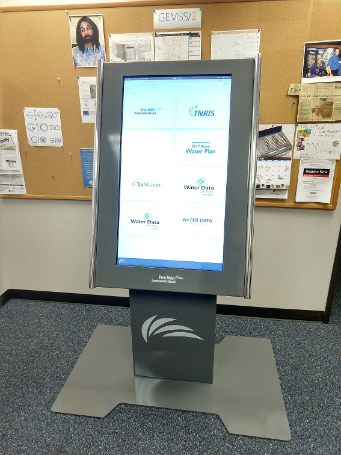

# **kiosk**
an app for viewing apps on a kiosk

### Overview
This project is a simple static web application combined with a customized system on the Texas Water Development Board's kiosk itself. The web app can be accessed by visiting the url http://kiosk.tnris.org and the content is hosted directly from this repository (repo) using GitHub Pages with a custom domain. The site was created specifically to be displayed on the agency's kiosk (see below photo) to act as a menu for viewing other existing TWDB web applications. Based on the user's selection from the kiosk menu, the kiosk app creates a window to that app using a dynamically created iframe while allowing the user to go back to the main menu from the bottom navigation bar. The bottom navigation bar is necessary due to the browser on the kiosk being in fullscreen, or kiosk mode. This means that the traditional browser navigation menu is absent. The url of the app the user selects from the main menu is displayed at the bottom right of the navigation bar. In case a user leaves the kiosk with an app or site open, the kiosk app reloads after 10 min of inactivity (clicks/touches) which will bring it back to the main menu.



The kiosk hardware consists of a small Dell computer with Ubuntu 18.04 Bionic Beaver operating system installed. Ubuntu 18 was chosen due to it working well out of the box with the kiosk touchscreen. Every day at 1830, a cron task (`/system-scripts/kiosk-crontab.bak`) kills Chromium and calls a Bash script called `sleep.sh`. The sleep script puts the machine to sleep for 12.5 hours, after which it will awaken, switch to user tnris, and call the `start-kiosk.sh` Bash script. This script runs Chromium with the necessary flags/switches needed for the kiosk (see below Cron & Bash section regarding the switches used with more detail). If the kiosk touchscreen is inactive for 13 minutes, a Chromium extension called Photo Screen Saver will show TWDB images stored on a cloud drive as a screen saver until a user interrupts it.

### Kiosk System Components
* [Dell OptiPlex 9020 Micro PC](http://www.dell.com/ae/business/p/optiplex-9020m-desktop/pd)
* [Ubuntu 18.04](http://releases.ubuntu.com/releases/18.04/)
* [Chromium](https://www.chromium.org/Home)
* [Bash](https://www.gnu.org/software/bash/)
* [Cron](https://en.wikipedia.org/wiki/Cron)
* [Photo Screen Saver](https://chrome.google.com/webstore/detail/photo-screen-saver/kohpcmlfdjfdggcjmjhhbcbankgmppgc?hl=en-US)

### Instructions for Kiosk Setup
1. Install Ubuntu v18.04 Bionic Beaver on the Kiosk machine.
    - Create a bootable USB stick with  [Windows](https://tutorials.ubuntu.com/tutorial/tutorial-create-a-usb-stick-on-windows#0), [Mac](https://tutorials.ubuntu.com/tutorial/tutorial-create-a-usb-stick-on-macos#0), or [Linux](https://tutorials.ubuntu.com/tutorial/tutorial-create-a-usb-stick-on-ubuntu#0).
    - [Install Ubuntu](https://tutorials.ubuntu.com/tutorial/tutorial-install-ubuntu-desktop#0)

2. Install Chromium browser, if it's not already installed using either apt or [snap](https://tutorials.ubuntu.com/tutorial/basic-snap-usage#0) package manager.
    - The newer snap way: `sudo snap install chromium`
    - The apt way: `sudo apt install chromium-browser`

**Note:** The method you choose to install chromium will determine the command/path you use in the scripts. Using the apt way = `chromium-browser` calls the browser; the snap way = `chromium` to call the browser. The scripts in this repo used the snap method - `/snap/bin/chromium`.

3. Sign into a Google account so you are able to install extensions to Chromium from the Chrome Store.

4. Install the [Photo Screen Saver](https://chrome.google.com/webstore/detail/photo-screen-saver/kohpcmlfdjfdggcjmjhhbcbankgmppgc) Chromium/Chrome extension from the Chrome Store.
    - In the extension setup, provide a Google Drive/Photos location of photos for the extension to use.
    - Set the screen saver to start when idle for 13 minutes; also test transitions and animations in the settings if you desire. Set any other settings you need.

5. Copy the system scripts `sleep.sh`, `start-kiosk.sh`, and `clear-chromium-crash.sh` into the `/home` directory.

6. Open terminal, run `sudo crontab -e`, specify which text editor you want to use (nano), paste the command that is in the `kiosk-crontab.bak` file (only the line that isn't commented out) into the crontab.
    * Or, you can source directly from the backup file into the cron table:`sudo crontab < /path/to/kiosk-crontab.bak`

7. Open Ubuntu's Startup Applications Preferences (search Ubuntu dash using keyword 'startup').
    - Create startup app for start-kiosk.sh bash script
      - choose 'Add'
      - type in Name = 'start-kiosk' or similar
      - command = `/path/to/start-kiosk.sh` bash script (should be `home/start-kiosk.sh`)
    - Create startup app for clear-chromium-crash.sh bash script
      - choose 'Add'
      - type in Name = 'clear-chromium-crash' or similar
      - command = `/path/to/clear-chromium-crash.sh` bash script (should be `home/clear-chromium-crash.sh`)

### Cron & Bash
All cron and bash system scripts are located in **/system-scripts** of this repo. On the kiosk itself, all system scripts are placed in the `/home` directory. The **clear-chromium-crash.sh** and **start-kiosk.sh** scripts are also added to Startup Applications in case the computer is intentionally shutdown, loses power, or is rebooted. **User Permissions**: To setup the cron task on the kiosk machine, root access is necessary to edit the crontab using the command `sudo crontab -e`. The sleep script also requires root privileges to run the `rtcwake` command. The sleep script runs, then switches to the regular admin user (in this case user is tnris) using `su` command before running `start-kiosk.sh`.

**kiosk-crontab.bak** <br>
Cron is a Linux utility that allows tasks to be automatically run in the background at regular intervals by the cron daemon. The kiosk uses it everyday at 1830 to kill all Chromium processes and to call the `sleep.sh` Bash script:

`30 18 * * * if pgrep chromium;then kill $(pgrep chromium);fi;/home/tnris/sleep.sh`

**sleep.sh** <br>
The sleep script tells the kiosk system to go to sleep for 12.5 hours (45000 seconds), wakes up, restarts the OS which then calls the `start-kiosk.sh` script from the startup application settings.
```
# arbitrary time in order to give cron enough time to kill chromium, etc.
sleep 7

# Freezes all processes for 45000 seconds (12.5 hrs)
sudo rtcwake -m freeze -l -s 45000

# arbitrary time in order to give system enough time to wake properly
sleep 5

# Restart kiosk on wake up
sudo shutdown -r now
```
**start-kiosk.sh** <br>
Run Chromium with the necessary flags/switches and go to the kiosk address at http://kiosk.tnris.org. The switches which are necessary for the kiosk to properly run Chromium in kiosk mode are `--kiosk`. Additionally, to prevent users from losing navigation controls, disabling browser web-security with `--disable-web-security` and `--user-data-dir` is necessary. Disabling web-security allows the kiosk web app to bypass the [same-origin policy](https://en.wikipedia.org/wiki/Same-origin_policy) which prevents any web page from accessing data in another web page if they do not have the same origin/domain. This allows the kiosk app's javascript to modify the front end of the iframed applications so it can prevent a user from opening a new browser tab. Preventing new tabs is necessary because when the browser is in kiosk mode, traditional browser navigation is unavailable. The kiosk javascript searches the DOM every time an iframed application page is loaded to look for `<a>` tags with a target attribute present. If it finds that attribute, it removes it. This keeps all pages inside the iframe. This functionality even works for dynamically created content, such as with React.js, by rerunning the DOM search every time a user clicks in the app iframe.
```
export DISPLAY=:0

/snap/bin/chromium \
  --kiosk \
  --profile-directory=Default\
  --test-type \
  --disable-web-security \
  --user-data-dir \
  http://kiosk.tnris.org
```
**clear-chromium-crash.sh** <br>
If Chromium crashes (usually due to rebooting), clear the crash flag so the warning bar in Chromium doesn't appear which would prevent the kiosk from opening the browser at the kiosk url.
```
sed -i 's/"exited_cleanly":false/"exited_cleanly":true/' snap/chromium/367/.config/chromium/Default/Preferences
sed -i 's/"exit_type":"Crashed"/"exit_type":"Normal"/' snap/chromium/367/.config/chromium/Default/Preferences
```
### Web Application Components
* [GitHub Pages](https://pages.github.com/)
* [jQuery v3.3.1](https://jquery.com/)
* [Bootstrap v4.1.1](https://getbootstrap.com/)
* [Google Fonts - Montserrat](https://fonts.google.com/specimen/Montserrat)
* [Font Awesome v5.1.1](https://fontawesome.com/)
* [AWS Route 53](https://aws.amazon.com/route53/)

For local development / testing:
* [node.js v8.11.1](https://nodejs.org/en/blog/release/v8.11.1/)
* [http-server v0.11.1](https://www.npmjs.com/package/http-server)

### Instructions for Local Development Setup
1. Install node.js v8.11.1 or the most recent release version is probably fine too. Download [here](https://nodejs.org/en/download/).

2. npm should be installed with node.js, so just run this command to install the http-server package:

    `npm install http-server -g`

3. Clone the TNRIS/kiosk repository with git using the command: `git clone https://github.com/TNRIS/kiosk.git`

4. CD into the repo using the terminal.

5. Run the command `http-server` and a server running the app should now be viewable at http://localhost:8080.

6. *** To view the app exactly as it is meant to run on the kiosk with web security disabled, open a new terminal window (make sure your server running the app at local port 8080 stays running) and type the command:

    `chromium-browser --disable-web-security --user-data-dir http://localhost:8080`.

**Note:** *** Change the command `chromium-browser` to `chromium` if you've installed the browser using snap / the Ubuntu software center.

### DNS
Amazon Web Services (AWS) [Route 53](https://aws.amazon.com/documentation/route53/) is used for the Domain Name System (DNS) web service to register **kiosk.tnris.org**. This is the custom domain for this web application, which is a subdomain of tnris.org.

**Access DNS settings for http://kiosk.tnris.org** :
  - Login to the TNRIS AWS services console
  - Under Route53 - Hosted zones - Select tnris.org
  - Scroll down to kiosk.tnris.org and select the record set
  - The record set edit options and settings appear on the right-side
